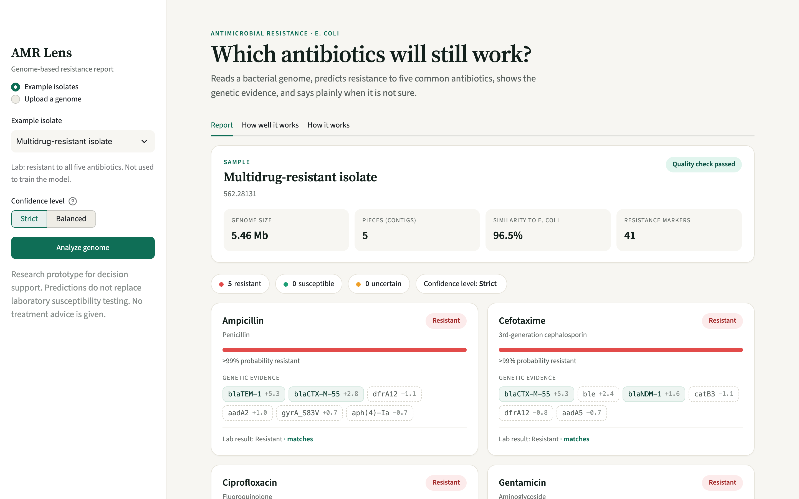
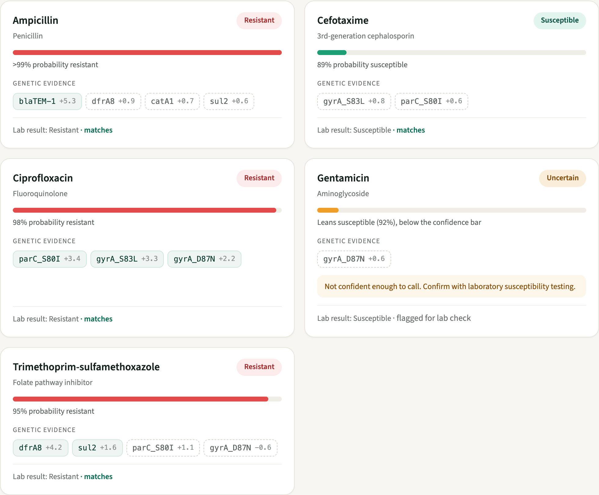
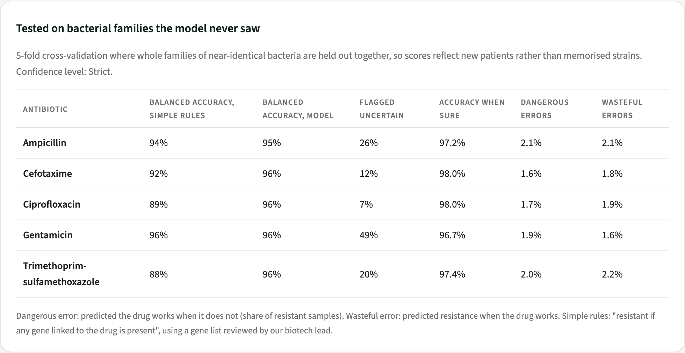

# AMR Lens

Turning bacterial DNA into antibiotic answers doctors can act on.

AMR Lens takes the genome of an *E. coli* sample, finds the resistance genes in it, and predicts whether five common
antibiotics will still work. Each answer shows the genes behind it. When the model isn't confident enough, it says
"uncertain" and asks for a lab test instead of guessing.

Built for the AI + Healthcare hackathon track: *make healthcare information clearer, more accessible, or easier to act on.*

- **Live app:** https://amr-lens.streamlit.app (example samples only; uploading needs the local setup below)
- **Demo video:** [link]

> Research prototype. It does not replace laboratory susceptibility testing and gives no treatment advice.

## Demo video

<!-- Add the recording here -->

## Why we built this

When someone has a serious bacterial infection, the lab grows the bacteria and tests antibiotics on it. That takes
2 to 3 days. Until then, doctors have to guess, and they often reach for strong broad-spectrum drugs, which makes
resistance worse. Antimicrobial resistance directly caused about 1.27 million deaths in 2019 (GRAM study, The Lancet, 2022).

Sequencing a bacterium's DNA is now cheap and quick, and the DNA already contains the resistance genes. But today's
tools return a list of gene names like `blaCTX-M-15, gyrA_S83L, sul1`. That's hard for a doctor to act on, and it
doesn't say how reliable each result is. AMR Lens turns that list into a short report.

## What the app shows

Pick one of the example samples, or upload an assembled genome. You get a call per antibiotic, how likely it is, the
genes that drove it, and the lab result when we know it.



When the model isn't sure, it says so. Here gentamicin is flagged instead of guessed:



Solid chips are genes known to cause resistance to that drug. Dashed chips are genes that tend to show up alongside
resistance but don't cause it. The numbers are the weight the model gives each gene.

The "How well it works" tab shows the test results:



## How it works

**Biology side**

1. We collected 12,126 *E. coli* genomes with lab test results from the public [BV-BRC](https://www.bv-brc.org) database.
2. We removed broken or mislabelled genomes: wrong size, too fragmented, or not actually *E. coli*.
3. Where labs only reported a raw measurement (MIC), we turned it into resistant or susceptible using the
   [EUCAST](https://www.eucast.org) v16.1 clinical breakpoints for systemic infections.
4. We scanned every genome with NCBI's [AMRFinderPlus](https://github.com/ncbi/amr), which finds known resistance genes
   and mutations. That gave us 331 markers seen in at least 5 genomes.
5. Our biotech lead reviewed which gene affects which antibiotic.

**Machine learning side**

1. Many samples are near-copies of each other (outbreaks, hospital strains). We grouped them into 807 families using
   [Mash](https://github.com/marbl/Mash) DNA distances, and always test on families the model never saw. Otherwise it
   could memorise strains and look better than it is.
2. One logistic regression model per antibiotic, using the 331 markers as yes/no inputs. We also tried LightGBM; it
   wasn't better, and logistic regression lets us explain every prediction exactly.
3. Conformal prediction sets a confidence threshold for each antibiotic, so that confident answers keep a chosen
   error rate (about 2% on the Strict setting). Anything below the threshold is reported as uncertain.
4. A short summary can be written by Claude from the report's results. It only rephrases what the model found; it
   never changes a call. It needs an API key and is off by default.

## Results

All numbers are on bacterial families the model never saw during training (5-fold cross-validation, grouped by family).

| Antibiotic | Balanced accuracy | Accuracy when confident | Flagged uncertain | Expert gene rules |
|---|---|---|---|---|
| Ampicillin | 95.0% | 97.2% | 27% | 94.0% |
| Cefotaxime | 96.0% | 98.0% | 12% | 91.8% |
| Ciprofloxacin | 95.7% | 98.0% | 7% | 88.5% |
| Gentamicin | 95.8% | 96.7% | 49% | 95.8% |
| Trimethoprim-sulfamethoxazole | 95.7% | 97.4% | 20% | 87.7% |

"Accuracy when confident" and "flagged uncertain" are for the Strict setting. On that setting, the dangerous error
(saying a drug works when it doesn't) is 1.6–2.1% for every drug. The usual bar for lab tests is around 1.5%, so
we're close but not there yet.

A few things we learned along the way:

- **More data from more studies helped a lot.** Going from 6,000 to 12,000 genomes cut uncertain answers for
  cefotaxime from 60% to 12%, at the same error rate.
- **A model trained on one study does worse on others.** Trained only on our first batch (mostly one Norwegian study)
  and tested on new studies, cefotaxime dropped to 83% balanced accuracy.
- **Expert rules are good when resistance is simple.** For ampicillin and gentamicin, "resistant if a known gene is
  present" is about as good as the model. The model pulls ahead for ciprofloxacin and trimethoprim-sulfamethoxazole,
  where resistance depends on combinations of genes. Rules also can't say when they're unsure.
- **The model found errors in the lab data.** In two cases where it disagreed with the lab label, the lab's own
  measurement agreed with the model. We found 93 such contradictions, all from one study
  (`data/processed/suspect_labels.csv`).

## Limitations

- It only knows resistance genes that are already in the database. A new mechanism is invisible to it, and it won't
  necessarily flag that as uncertain.
- *E. coli* only, five antibiotics.
- The bacteria still has to be grown before it can be sequenced. This saves the testing step, not the growing step.
- Gentamicin still gets a lot of uncertain answers (49% on Strict).
- Not validated in a hospital and not approved for clinical use.

## Running it

**Just the app with the example samples** (Python 3.13):

```bash
python3 -m venv .venv
.venv/bin/pip install -r requirements.txt
.venv/bin/streamlit run app.py
```

Then open http://localhost:8501. You can also open an example directly, e.g. `http://localhost:8501/?example=562.28131`.

**Uploading your own genome** also needs the bioinformatics tools. On Linux, or on Apple Silicon through Rosetta:

```bash
CONDA_SUBDIR=osx-64 conda create -n amr --override-channels -c conda-forge -c bioconda \
  python=3.11 ncbi-amrfinderplus mlst mash seqkit
conda run -n amr amrfinder -u
```

The app looks for the tools in `/opt/miniconda3/envs/amr/bin`; set `AMR_BIN` if they're somewhere else. Without them,
the app only offers the examples. A scan takes about a minute.

For a live test, upload `demo/upload_test_562.141160.fna.gz`. It's a real hospital isolate carrying the KPC-2
carbapenemase gene, and it was kept out of training. The app reads its BV-BRC ID from the file and shows the lab
results next to the predictions.

**AI summary (optional):** put `ANTHROPIC_API_KEY=...` in a `.env` file in this folder.

## Rebuilding the data and models

The raw data (about 25 GB of genomes, scans and fingerprints for the full set) isn't in the repo. Everything can be rebuilt from public data with
the scripts:

```bash
.venv/bin/python pipeline/fetch_labels.py                          # lab results from BV-BRC
nohup caffeinate -is pipeline/overnight.sh > data/raw/overnight.log 2>&1 &   # download, scan, measure, analyse (overnight)
./run_all.sh                                                       # re-run the analysis only (~2 min)
```

`docs/PROJECT_LOG.md` walks through every step, what we tried, and what went wrong.

## Repo layout

```
app.py, report.py        the app and the report engine
pipeline/                downloading, scanning, quality checks, families, MIC-to-label conversion
pipeline/breakpoints.csv, drug_marker_map.csv   EUCAST cutoffs and the reviewed gene-to-drug map
model/                   feature table, rule baseline, training, confidence, final models
data/processed/          result tables (features, labels, QC, families, results)
data/models/             saved models
demo/                    example genomes used in the app
docs/                    project log and screenshots
```

## Built with

BV-BRC, EUCAST breakpoint tables, NCBI AMRFinderPlus, Mash, seqkit, mlst, Python, pandas, scikit-learn, LightGBM,
Streamlit, and the Claude API.

## Team

- [Name]: AI and software
- [Name]: biotechnology and data curation
