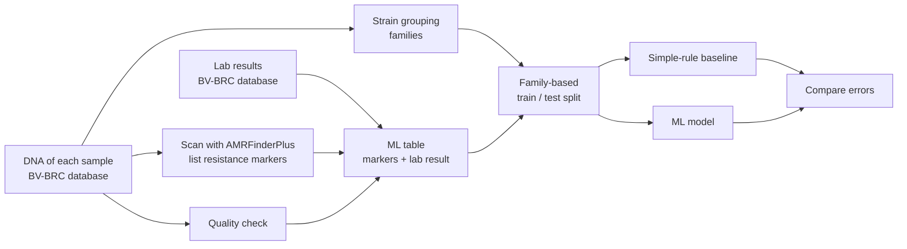
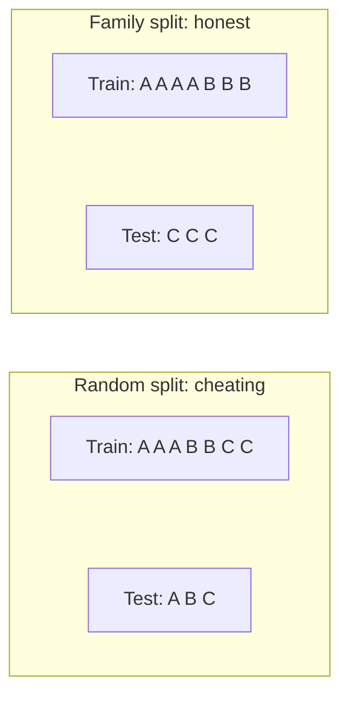

# Project log: what we did, why, and what we found

Plain-language record of every step, written for teammates without a biology or bioinformatics background.
Newest status is at the top; the steps below are in the order we did them.

- Full plan, glossary and schedule: [project doc](https://claude.ai/code/artifact/7dbc4cdf-5882-4763-9f38-e686a4678c90)
- Short technical notes for AI assistants: [`CLAUDE.md`](../CLAUDE.md)

## Current status (Sun Oct 4, midday)

| Step | Status |
|---|---|
| 0. Setup and feasibility check | Done |
| 1. Download lab results | Done |
| 2. Download + scan 6,000 genomes (overnight) | Done |
| 3. Build the ML table | Done |
| 4. Quality check | Done: 5,935 pass, 56 fail |
| 5. Strain grouping (families) | Done: 544 families. `mlst` family names still running (descriptive only) |
| 6. Simple-rule baseline | First version done (with draft marker map) |
| 7. First ML model | Done (v1): big gain over draft rules, but dangerous-error rate still too high |
| 8. Confidence + "uncertain" flag | Done (v1): dangerous errors cut 2–5x by flagging 12–30% of samples as uncertain |
| 9. Re-run with biotech lead's corrected map + breakpoints | Waiting on biotech lead |
| Biotech lead: breakpoints, marker map review | Waiting (see message sent Oct 4) |

---

## The project in one picture

**The ML framing:** each row is one bacterial sample. The **inputs** are which resistance markers its DNA
contains (0/1 columns). The **label** is the lab result for an antibiotic (1 = resistant, drug won't work;
0 = susceptible, drug works). One model per antibiotic.

---

## Step 0: Setup and feasibility check (Oct 4, ~1 am)

**What:** Installed the tools, created the repo, and tested the whole idea on 10 samples before committing to it.

**Why:** Find out on day 1 whether the data exists and the tools run, not on day 3.

**How:**
- Bioinformatics tools (AMRFinderPlus, mlst, Mash, seqkit) are installed in a conda environment called `amr`.
  They only exist for Intel Macs, so they run through Rosetta (Apple's Intel emulator). Command in `CLAUDE.md`.
- Python ML libraries are in `.venv` (`requirements.txt`).

**Result:** Everything works. On 10 test samples, every ciprofloxacin-resistant one had mutations in the
genes *gyrA* and *parC* (the textbook mechanism), and every susceptible one didn't. 10 of 10 made biological sense.

---

## Step 1: Download the lab results (Oct 4, ~1 am)

**What:** Downloaded every lab-measured antibiotic result for *E. coli* from the public BV-BRC database.

**Why:** These are our labels: the "right answers" the model learns to predict.

**How:** [`pipeline/fetch_labels.py`](../pipeline/fetch_labels.py) calls the BV-BRC web API. Two snags:
- The API returns at most 25,000 rows per request, so the script asks page by page.
- The API blocks Python's default "user agent" (the name a program sends to identify itself), so we send our own.

**Result** (file: `data/raw/bvbrc_ecoli_amr.tsv`, not in git because it's large):
- 243,124 lab results across 12,627 *E. coli* samples.
- 94k results have a verdict (resistant/susceptible). 148k have only a raw number (MIC, below).

**Decisions:**
- **Our 5 antibiotics:** ampicillin, cefotaxime, ciprofloxacin, gentamicin, trimethoprim/sulfamethoxazole.
- **Dropped meropenem:** only 69 resistant samples, too few to learn from.
- **Swapped ceftriaxone for cefotaxime:** same drug family, 7x more data.

**What is an MIC?** The lowest amount of antibiotic (in mg/L) that stops the bacteria growing. High MIC = tough
bacteria. To turn an MIC into a verdict you need an official cutoff (a "breakpoint") from the EUCAST rulebook.
That's the biotech lead's Task 1 ([`pipeline/breakpoints.csv`](../pipeline/breakpoints.csv)).

---

## Step 2: Download and scan 6,000 genomes (overnight, Oct 4, 1:43 am to ~10 am)

**What:** Downloaded the DNA of 6,000 samples and scanned each one for known resistance markers.

**Why:** The markers found in each sample's DNA are the model's inputs.

**How:** [`pipeline/fetch_and_scan.py`](../pipeline/fetch_and_scan.py)
1. Picks the 6,000 samples with lab results for the most of our 5 drugs (list saved in
   `data/processed/genome_list.csv`).
2. Downloads each DNA file (~5 million letters, A/C/G/T) and saves it compressed (`data/genomes/`).
3. Runs **AMRFinderPlus** (a free NCBI tool) on it, which lists every known resistance gene and mutation
   (`data/amrfinder/<sample>.tsv`).
4. Runs 8 samples at a time. It's resumable: if it crashes, re-running skips finished samples.
5. Ran under `caffeinate` so the Mac didn't sleep. The lid must stay open.

**Result:** 5,991 of 6,000 scanned in ~8 hours. The 9 failures were incomplete files in the database
(0.3–1 MB instead of ~5 MB), rejected on purpose (`data/processed/failed.txt`). Uses 14 GB of disk.

**Examples of markers:**
- `blaTEM-1`: a gene for an enzyme that destroys ampicillin.
- `gyrA_S83L`: a one-letter "typo" in the gene ciprofloxacin attacks, so the drug can't grab on.

---

## Step 3: Build the ML table (Oct 4, ~11 am)

**What:** Joined the scan results with the lab results into one table.

**How:** [`model/build_table.py`](../model/build_table.py) produces three files in `data/processed/`:

| File | What's in it | Who it's for |
|---|---|---|
| `overview.csv` | One row per sample: verdict per drug + list of markers found | Humans (open in Excel/Numbers) |
| `features.csv` | Same markers as 0/1 columns (229 columns) | The model (inputs) |
| `labels.csv` | 1 = resistant, 0 = susceptible, blank = no lab result | The model (answers) |

Only "AMR"-type markers are used for now (resistance genes and mutations). Markers seen in fewer than 5 samples are
dropped: 229 kept out of 744.

**Result:**

| Antibiotic | Resistant | Susceptible | No lab result |
|---|---|---|---|
| Ampicillin | 2,845 | 2,399 | 747 |
| Cefotaxime | 722 | 4,308 | 961 |
| Ciprofloxacin | 1,270 | 4,504 | 217 |
| Gentamicin | 668 | 5,114 | 209 |
| Trimethoprim/sulfamethoxazole | 1,391 | 2,691 | 1,909 |

**Odd cases sent to the biotech lead:**
- `562.100000` has an ESBL gene (`blaCTX-M-15`) but the lab says cefotaxime works.
- `562.100002` resists ampicillin with no obvious ampicillin gene.

**Correction to earlier advice:** converting the 148k raw MIC numbers barely fills blanks in *these* 6,000
(~120 cells), because we picked samples that already had verdicts. Its real value: (1) **5,022 extra samples**
we haven't downloaded have MIC-only results, a possible second overnight run (~11 GB); (2) 3,253 of our results have
both a verdict and an MIC, so we can check whether old verdicts match today's rules.

---

## Step 4: Quality check (Oct 4, midday)

**What:** Make sure every DNA file is complete, unmixed and really *E. coli*.

**Why:** A broken file looks like "no resistance genes," which would teach the model wrong lessons.

**How:** `seqkit stats` measures each file (`data/processed/qc_stats.tsv`); Mash measures how different each sample
is from a confirmed *E. coli* (`data/processed/species_dist.tsv`). Rules in
[`pipeline/qc_and_lineage.py`](../pipeline/qc_and_lineage.py):

| Check | Rule | Why | Failed |
|---|---|---|---|
| Size | 4.5–6.0 million letters | Smaller = incomplete; bigger = two samples mixed | ~26 |
| Pieces (contigs) | 500 or fewer | More = shattered assembly, genes may be cut in half | ~26 |
| Species | < 5% different from *E. coli* | More = mislabelled species | 16 |

**Result** (`data/processed/qc.csv`): 5,935 pass, 56 fail (26 wrong size, 21 too fragmented, 9 not *E. coli*).

---

## Step 5: Strain grouping into families (Oct 4, in progress)

**What:** Sort samples into families of near-identical relatives.

**Why: to stop the model cheating.** An outbreak can give us dozens of near-copies of one bacterium. If some copies are
in training and some in testing, the model can memorise instead of learning, like seeing exam questions in advance.
So we split by family: whole families go into training or into testing, never both. That tests what matters for a
new patient: does it work on bacteria it has never seen?

**How:**
1. **Fingerprints:** Mash takes 10,000 sampled snippets of each sample's DNA (`data/mash/all.msh`).
2. **Compare every pair:** 36 million comparisons; keep pairs less than 1% different (`data/mash/pairs.tsv`).
3. **Link and group:** draw a link between any two samples less than 0.5% different. Each connected group is one
   family (graph "connected components", one `scipy` call). Output: `data/processed/lineage.csv`.
4. **Family names (sequence types):** `mlst` gives each sample a standard ID (e.g. ST131, a well-known drug-resistant
   family). Used only to describe results, **never as a model input** (that would let the model recognise families).

**Result** (`data/processed/lineage.csv`): at the 0.5% cutoff, **544 families**. The largest holds 767 samples
(13%), and 320 samples have no close relative. We also tried 0.2% (1,699 families, many tiny) and 1% (one giant
family with 40% of samples, which would make the split lopsided), so 0.5% is the middle ground.

**Bug found and fixed:** `mlst` labelled ~280 *E. coli* as *Salmonella*. Its warning showed why: for some samples two
species schemes score exactly equal, and it picks one at random. Running the same file 6 times gave different answers.
Mash confirmed these samples are *E. coli* (0.2–3% different from other *E. coli*; real *Salmonella* would be
~20%). Fix: force the *E. coli* scheme (`--scheme ecoli_achtman_4`) and check species with Mash.
**Lesson:** when a tool says something surprising, confirm it with a second method before believing it.

---

## Step 6: Simple-rule baseline (Oct 4, midday)

**What:** Predict like existing tools: "if the sample has any marker linked to this drug → resistant."

**Why:** A number to beat. "Our model is 90% accurate" means nothing without a baseline.

**How:** [`model/baseline_rules.py`](../model/baseline_rules.py), using the draft marker → drug map in
[`pipeline/drug_marker_map.csv`](../pipeline/drug_marker_map.csv) (auto-guessed; the biotech lead is reviewing it).

**How we score:** two kinds of mistakes matter clinically.

| | Model: drug won't work | Model: drug works |
|---|---|---|
| **Lab: drug won't work** | Correct | **Very major error**: useless drug given (dangerous) |
| **Lab: drug works** | **Major error**: stronger drug used needlessly (wasteful) | Correct |

**Result with the draft map** (all samples, before the QC filter):

| Antibiotic | Very major error | Major error | Balanced accuracy |
|---|---|---|---|
| Ampicillin | 0.1% | 99.9% | 50.0% |
| Cefotaxime | 5.7% | 25.0% | 84.6% |
| Ciprofloxacin | 1.3% | 39.1% | 79.8% |
| Gentamicin | 8.2% | 0.8% | 95.5% |
| Trimethoprim/sulfamethoxazole | 3.8% | 18.7% | 88.8% |

**Why the draft rules over-call resistance:** some mapped markers aren't predictive on their own.
- `blaEC` is a "background" gene in ~80% of all *E. coli*, so the ampicillin rule says "resistant" for almost everyone.
- `marR_S3N` is actually more common in susceptible samples (27%) than resistant ones (11%).
- Minor `parE` mutations alone don't make ciprofloxacin fail.

**Why this matters for the pitch:** expert rules need careful tuning (the biotech lead's review), while an ML model
can learn from the data which markers matter. Comparing the two is the core result.

---

## Step 7: First ML models (Oct 4, ~12:30 pm)

**What:** Trained two kinds of model per antibiotic and compared them with the rules on the same samples.
- **Logistic regression:** the simplest model. Gives each marker a weight ("how much does this marker push towards
  resistant?") and adds them up.
- **LightGBM:** a stronger model built from many small decision trees. It can learn combinations ("gyrA AND parC").

**How:** [`model/train.py`](../model/train.py). **5-fold family cross-validation:** split the 544 families into 5
groups; train on 4, test on the 5th, repeat 5 times so every sample gets tested exactly once by a model that never saw
its family. Also ran a random split for comparison. Results saved in `data/processed/results_v1.csv`.

**Result** (family split, threshold 0.5, no calibration yet):

| Antibiotic | Rules (draft): VME / ME | Logistic regression: VME / ME | Balanced accuracy, rules → LR |
|---|---|---|---|
| Ampicillin | 0.0% / 100% | 10.9% / 2.5% | 50.0% → 93.3% |
| Cefotaxime | 5.6% / 25.1% | 8.5% / 3.0% | 84.6% → 94.2% |
| Ciprofloxacin | 1.3% / 39.2% | 4.3% / 1.2% | 79.8% → 97.3% |
| Gentamicin | 7.9% / 0.8% | 7.1% / 1.4% | 95.7% → 95.7% |
| Trimethoprim/sulfamethoxazole | 3.3% / 18.5% | 5.5% / 4.4% | 89.1% → 95.0% |

VME = very major error (dangerous: said "works", it doesn't). ME = major error (wasteful).

**What it means (honest reading):**
1. **ML beats the draft rules by a lot**, mostly by cutting false "resistant" calls. But the draft rules are weak
   (auto-guessed map), so this comparison is not fair yet. **Re-run after the biotech lead corrects the map** before
   claiming anything in the pitch.
2. **The simple model is as good as or better than the complex one.** Resistance here is mostly "has gene X or not,"
   so logistic regression is enough. Simpler is also easier to explain to judges.
3. **The random split only inflates scores by ~1–2 points** here, smaller than feared, because our inputs are known
   resistance markers rather than raw DNA, which leaves less to memorise. Still worth reporting.
4. **Dangerous errors (4–11%) are far above the ~1.5% clinical target.** That's the job of the next step: the
   "uncertain" flag, so that when the model isn't sure it says "confirm with the lab" instead of guessing.

---

## Step 8: Confidence and the "uncertain" flag (Oct 4, afternoon)

**What:** Let the model say **UNCERTAIN, confirm with the lab** when it isn't sure, instead of guessing.

**Why:** In step 7 the model made dangerous errors (said "works" when it doesn't) for 4–11% of resistant samples.
The clinical target is around 1.5%. We can't make the model perfect, but we can make it **know when it's unsure**.

**How:** [`model/confidence.py`](../model/confidence.py), using a statistical method called **conformal prediction**:
1. We pick the error rate we're willing to accept, called **alpha** (e.g. 0.02 = at most ~2% errors).
2. On samples the model didn't train on, we look at how confident it was when it was right vs wrong, and set a
   **confidence bar** for each answer ("resistant", "susceptible") so that only ~alpha of true answers fall below it.
3. For a new sample: if exactly one answer clears its bar, that's the call. If both or neither do, it's UNCERTAIN.

**Trade-off:** a stricter alpha means fewer errors but more "uncertain" answers. Too many "uncertain" answers make the
tool useless; too few make it unsafe. The table shows that trade-off.

**First attempt failed, and why:** we first held back a random quarter of the training families for setting the
bars. Because some families are huge, one family made up 26–55% of that quarter, so the bars fit that one family
and didn't transfer: error rates came out up to 2x higher than promised. **Fix:** "cross-fitting". Rotate through
the training families so every training sample gets a prediction from a model that never saw its family, then set
the bars from all of them. After the fix, the promised error rates roughly hold.

**Result** (family split; `data/processed/results_conformal_v1.csv`). VME = dangerous error, as a share of all
truly resistant samples, same definition as step 7:

| Antibiotic | No flag (step 7): VME | alpha 0.02: uncertain | alpha 0.02: VME / ME | alpha 0.05: uncertain | alpha 0.05: VME / ME |
|---|---|---|---|---|---|
| Ampicillin | 10.9% | 30% | 2.4% / 1.9% | 8% | 4.8% / 4.4% |
| Cefotaxime | 8.5% | 60% | 1.5% / 1.8% | 16% | 5.3% / 4.2% |
| Ciprofloxacin | 4.3% | 12% | 2.3% / 1.4% | 3% | 3.1% / 1.7% |
| Gentamicin | 7.1% | 57% | 1.7% / 1.8% | 12% | 4.7% / 3.7% |
| Trimethoprim/sulfamethoxazole | 5.5% | 31% | 2.1% / 2.3% | 2% | 4.9% / 5.0% |

**What it means:**
1. **The flag works.** For ciprofloxacin, flagging 12% of samples as uncertain halves dangerous errors (4.3% → 2.3%)
   and the model is 98% accurate on the rest. For ampicillin, flagging 30% cuts them from 10.9% to 2.4%.
2. **Cefotaxime and gentamicin need many "uncertain" answers (57–60%) to reach ~2% errors.** They have the fewest
   resistant samples (668–722), so the model is less sure. More data (the MIC conversion) should help most here.
3. **Slight overshoot:** at alpha 0.02, two drugs land at 2.3–2.4% instead of ≤2%. The guarantee assumes new families
   resemble the training families, and that's only approximately true. We report it honestly.
4. **Still above the ~1.5% clinical target** except cefotaxime. Next levers: corrected marker map, more data, and
   possibly richer features (stress/efflux genes we left out).

---

## Gotchas (so nobody repeats them)

- BV-BRC's FTP server timed out; use their web API.
- BV-BRC's API blocks Python's default user agent; set a custom one.
- `mlst` autodetect breaks ties at random; always pass `--scheme ecoli_achtman_4`.
- The Claude Code background-task limit is 30 minutes; run long jobs with `nohup caffeinate -is ... &` so they
  continue independently.
- A MacBook sleeps when the lid closes, even with `caffeinate`. Keep it open and plugged in for overnight runs.

## Where the data lives

| Location | In git? | Contents |
|---|---|---|
| `data/raw/` | No (large) | Lab results download, run logs |
| `data/genomes/` | No (14 GB) | Compressed DNA of each sample |
| `data/amrfinder/` | No | One scan result per sample |
| `data/mash/` | No (~1 GB) | Mash fingerprints and pair distances |
| `data/processed/` | **Yes** | All small result tables (what the model and teammates use) |

Everything not in git can be rebuilt from the scripts and `data/processed/genome_list.csv`.
